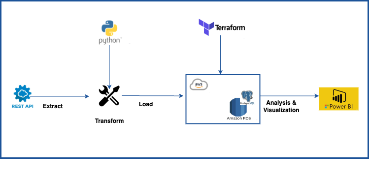

# Project Overview
This project leverages data from a public REST API to recommend travel destinations for customers of a travel agency. Recommendations are based on various factors, including language, continent, region, currency, and more.

## Tech Stack
This project involves an ETL process using the following technologies:

1. Python for data extraction and transformation.
2. Terraform for deploying infrastructure.
3. PostgreSQL hosted on AWS for database management.
4. Power BI for data analysis and visualization.

## ETL Process
The project follows these steps:

### Data Extraction:
Extract country information data from a public REST API using the requests library in Python.

### Data Transformation:
Apply necessary transformations to the extracted data to ensure it is in the correct format for analysis.

### Infrastructure Deployment:
Use Terraform to deploy a PostgreSQL database on AWS.

### AWS Initialization:
Initialize a session with AWS using Boto3 to interact with the cloud environment.

### Credential Management:
Retrieve database credentials securely from AWS.

### Data Loading:
Load the transformed data into the PostgreSQL database by creating the necessary tables and fields.

### Analysis and Visualization:
Conduct various analyses and visualizations using Power BI to provide travel destination recommendations to the agency's customers.

# Travel_agency

